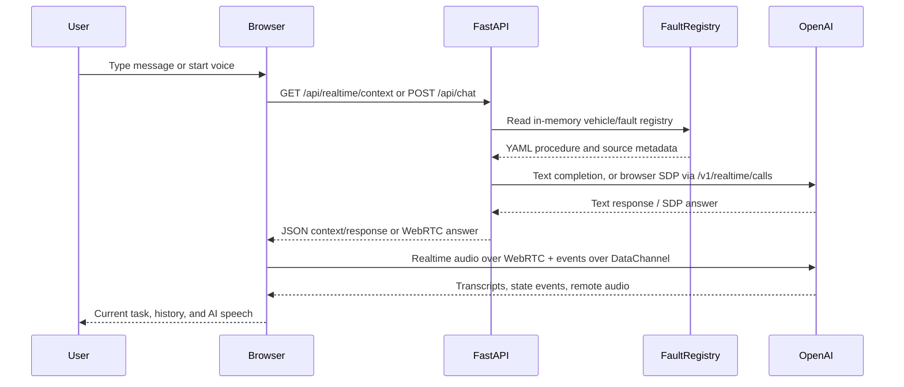

# PROJECT_CONTEXT

## 1. Project Overview

**EMU AI 故障處理助手**是一個以手機瀏覽器為主要入口的教學示範 MVP。它協助司機員或教學者用文字或 OpenAI Realtime 語音，描述 EMU 電聯車故障，並由 LLM 依照車型對應的故障處理 YAML，一次詢問一個問題、判斷回答並引導下一步。

目前 Repository 實際載入的資料是 **EMU700 / VCB 不閉合** 與 **EMU800 / VCB 不閉合**。兩者暫時使用相同流程內容、各自獨立 YAML；系統目標是自然語言、低延遲、適合語音展示；README 明確指出它不是正式上線的安全關鍵決策系統。

目前的主要實作狀態：

- FastAPI backend 可提供靜態前端、健康檢查、搜尋、文字聊天與 Realtime WebRTC 協商。
- 前端是無 bundler 的原生 HTML/CSS/JavaScript Voice-first UI。
- 文字聊天透過 OpenAI Chat Completions，Realtime 透過瀏覽器 WebRTC 連到 OpenAI Realtime API。
- 故障知識以 YAML graph 儲存；Realtime session 啟動時將目前註冊的 EMU700/EMU800 完整 YAML 一次注入，模型依已確認車型選用其中一份。
- Docker Compose 啟動單一 `app` service，對外提供 port 8000。
- 目前 branch 是 `main`，基準 commit 為 `0f73ee2 fix: update EMU800 VCB fault procedure`。目前工作區有未提交的 `settings/application.toml` 修改（threshold 設為 `0.9`）；文件中所有「目前」描述以工作區實際檔案為準。

## 2. System Architecture

```text
Browser (static/index.html + app.js + style.css)
       │
       ├── Text: POST /api/chat ──> LLMTroubleshootingService
       │                              │
       │                              ├── FaultRegistry
       │                              ├── complete YAML context
       │                              └── OpenAI Chat Completions
       │
       └── Voice: WebRTC SDP / DataChannel ──> FastAPI RealtimeService
                                      │
                                      ├── POST OpenAI /v1/realtime/calls
                                      ├── session config + routing-aware YAML instructions
                                      └── OpenAI Realtime audio response

Knowledge source:
settings/knowledge_sources.json
       ├── knowledge/EMU700/faults/vcb_not_close.yaml
       └── knowledge/EMU800/faults/vcb_not_close.yaml
```

FastAPI 只負責 HTTP endpoint、檔案服務、設定與 service 組裝。核心 LLM 對話由 `LLMTroubleshootingService` 管理；故障 YAML 的載入、graph validation、車型/故障 routing 由 `FaultRegistry` 管理。

## 3. Technology Stack

- Language: Python 3.12 backend；原生 JavaScript、HTML、CSS frontend；YAML/JSON/TOML configuration and knowledge data。
- Backend: FastAPI、Uvicorn、Pydantic v2、pydantic-settings。
- OpenAI integration: `openai` Python SDK 用於文字 Chat Completions 與語意解析；`httpx` 直接呼叫 Realtime client secrets / WebRTC calls endpoint。
- Realtime transport: browser `RTCPeerConnection`、DataChannel、remote `<audio>`；目前 backend session config 使用 OpenAI Realtime `server_vad`，threshold 由 application settings 提供。
- Knowledge validation: PyYAML + Pydantic models；active knowledge registry 是 YAML graph，不是 embedding/vector database。
- Legacy search storage: `sqlite3` FTS5 implementation 存在於 `app/knowledge.py`，但目前 active main routes 沒有使用它。
- Runtime/deployment: Docker image based on `python:3.12-slim`，Docker Compose；外部 HTTPS/Nginx 設定不在此 Repository。
- Dependencies are listed in `requirements.txt`: `fastapi`, `uvicorn[standard]`, `pydantic`, `pydantic-settings`, `openai`, `httpx`, `markdown-it-py`, `pytest`, `PyYAML`。

## 4. Repository Structure

```text
emuVoiceAssistan/
├── app/
│   ├── config.py
│   ├── main.py
│   ├── models.py
│   ├── chat.py
│   ├── llm_troubleshooting.py
│   ├── realtime.py
│   ├── troubleshooting.py
│   ├── semantic.py
│   ├── knowledge.py
│   └── __init__.py
├── knowledge/
│   ├── EMU700/faults/vcb_not_close.yaml
│   └── EMU800/faults/vcb_not_close.yaml
├── settings/
│   ├── application.toml
│   └── knowledge_sources.json
├── static/
│   ├── index.html
│   ├── app.js
│   ├── style.css
│   └── favicon.svg
├── tests/
│   ├── test_api.py
│   └── test_knowledge.py
├── Dockerfile
├── compose.yaml
├── requirements.txt
├── pytest.ini
├── README.md
├── Prompt.md
├── .env.example
├── .gitignore
└── PROJECT_CONTEXT.md
```

Excluded from this map: `.git`, `.venv`, `__pycache__`, pytest cache, local `.env`, and runtime database files.

## 5. Directory Responsibilities

### `app/`

Backend application code. `main.py` builds the FastAPI app and global service objects. The other modules separate configuration, API models, active LLM conversation handling, Realtime integration, YAML procedure validation, deterministic/legacy interpretation, and an older Markdown/SQLite knowledge implementation.

### `knowledge/`

Version-controlled operational knowledge. Each YAML file describes one vehicle/fault procedure as a directed graph of `decision`, `action`, `information`, and `end` nodes. It is loaded as complete context for the LLM rather than chunked into embeddings.

### `settings/`

Non-secret application configuration. `application.toml` contains model names and Realtime VAD threshold. `knowledge_sources.json` is the registry/catalog mapping vehicle and fault IDs to YAML files.

### `static/`

The complete frontend. `index.html` defines the Voice-first layout and debug drawer; `app.js` owns UI state, text requests, WebRTC lifecycle and Realtime event handling; `style.css` defines the blue/white/gray visual system and responsive layout.

### `tests/`

Pytest tests for health/search APIs, configuration validation, YAML loading/routing, prompt construction, Realtime audio/session configuration, frontend invariants, and text-chat history.

## 6. Important Files

| File | Responsibility | Related components |
|---|---|---|
| `app/main.py` | FastAPI app, startup reload, static file route, all HTTP routes, service wiring | `FaultRegistry`, `LLMTroubleshootingService`, `RealtimeService` |
| `app/config.py` | Loads TOML application settings and `.env` secret, validates model names/VAD range, resolves paths | every backend service |
| `app/models.py` | Pydantic request/response and conversation models | API, chat, troubleshooting |
| `app/llm_troubleshooting.py` | Complete LLM prompt, YAML context assembly, text Chat Completions, in-memory text sessions | `/api/chat`, `RealtimeService` |
| `app/realtime.py` | Realtime session config, client-secret call, SDP proxy call, safe error handling | `/api/realtime/*`, browser WebRTC |
| `app/troubleshooting.py` | YAML schema/graph validation, registry/routing, deterministic procedure engine and compatibility helpers | startup, legacy routes, tests |
| `app/semantic.py` | Fast natural-language matching and optional structured OpenAI interpretation | deterministic engine |
| `app/knowledge.py` | Markdown section parser + SQLite FTS5 knowledge base (currently not wired into active main flow) | legacy/unused path |
| `settings/knowledge_sources.json` | Declares available vehicles/faults and YAML paths | `FaultRegistry` |
| `knowledge/EMU700/faults/vcb_not_close.yaml` | Initial EMU700 VCB-not-close procedure template (currently copied from EMU800 apart from identifiers) | prompt and registry |
| `knowledge/EMU800/faults/vcb_not_close.yaml` | Complete EMU800 VCB-not-close procedure graph | prompt and registry |
| `static/index.html` | Mobile Voice-first page structure, current-task card, Voice Orb, drawers, debug panel, remote audio | `static/app.js`, `style.css` |
| `static/app.js` | Frontend state and API/WebRTC event flow | all user interactions |
| `static/style.css` | Design tokens, Orb/status styles, drawers, responsive/mobile behavior | `index.html` |
| `Dockerfile` | Production image, copies app/knowledge/settings/static, runs Uvicorn | Compose |
| `compose.yaml` | Single app service, port 8000, secret injection, restart policy, data volume/healthcheck | Docker deployment |
| `tests/test_api.py` | API/config/frontend contract tests | CI/local validation |
| `tests/test_knowledge.py` | YAML, registry, prompt and Realtime contract tests | knowledge/realtime validation |

## 7. Application Startup Flow

```text
docker compose up
  ↓
container WORKDIR /app, Uvicorn app.main:app
  ↓
app.config imports:
  load settings/application.toml with tomllib + Pydantic
  load OPENAI_API_KEY from process environment / .env
  resolve knowledge_sources.json and database paths
  ↓
app.main constructs:
  FaultRegistry
  TroubleshootingEngine + ConversationOrchestrator
  legacy ChatService
  LLMTroubleshootingService
  RealtimeService
  mounts /static
  ↓
FastAPI startup event calls fault_registry.reload()
  ↓
knowledge_sources.json is read; each configured YAML is parsed,
validated as a graph, and placed in the in-memory registry
```

The OpenAI client is created by `LLMTroubleshootingService` and `NaturalLanguageInterpreter` only when an API key is available. Missing key does not prevent the HTTP app from starting, but OpenAI-dependent operations return an application error and `/health` reports `openai_configured: false`.

## 8. Core Runtime Flow

### Text chat

1. `static/app.js` submits `POST /api/chat` with `{session_id, message}`.
2. `app.main.chat()` delegates to the global `chat_service` (`LLMTroubleshootingService`).
3. `LLMTroubleshootingService._get_session()` creates or reuses an in-memory `ConversationSession` keyed by `session_id`.
4. `build_context(vehicle, fault_id)` builds the catalog and reads all registered YAML blocks up front. Routing values affect instructions only; no later YAML fetch is required.
5. `chat()` sends the system prompt plus the last 24 session messages to `OpenAI.chat.completions.create()` using `settings.openai_text_model`.
6. The reply and metadata are stored in the in-memory session and returned as `ChatResponse`; the frontend updates the current-task card and history drawer.

The active text path is LLM-driven. It does not call `TroubleshootingEngine` to calculate the next node.

### Realtime voice

1. The frontend starts from `voiceButton` in `static/app.js`.
2. It requires a secure context and `navigator.mediaDevices.getUserMedia()` with echo cancellation, noise suppression, and auto gain control.
3. It fetches `/api/realtime/context`, which returns debug context, complete instructions, source metadata, and `RealtimeService.session_config()`.
4. The browser creates an `RTCPeerConnection`, adds the local audio track, creates the `oai-events` DataChannel, creates an SDP offer, and posts it to `/api/realtime/call`.
5. `RealtimeService.create_call()` sends the normalized SDP to OpenAI `/v1/realtime/calls?model=...` using the server-side API key, then returns the SDP answer.
6. When the DataChannel opens, the browser sends `session.update` containing both registered YAML procedures and generic routing instructions; it does not send an opening `response.create`.
7. Realtime events are handled in `handleRealtimeEvent()`: connection/session/error events update UI state; user transcription events become user history messages and are posted to `/api/realtime/route` for deterministic routing/debug state; AI audio-transcript deltas stream into an AI message; `remoteAudio` plays the received audio track.
8. Realtime input is currently configured by backend as `server_vad` with `create_response: true`, `interrupt_response: true`, and the configured threshold. The browser frontend at the current baseline uses click-to-toggle connection lifecycle; microphone/Realtime behavior should therefore be changed carefully and tested against this event contract.

### Compatibility/legacy Realtime HTTP routes

`/api/realtime/getCurrentStep`, `/submitAnswer`, `/processTroubleshooting`, and `/searchKnowledge` use the global `legacy_chat_service` and deterministic `ConversationOrchestrator`. They are not used by the current `static/app.js` voice path (the frontend tests explicitly ensure it does not call `/api/realtime/submitAnswer`). Treat them as compatibility/legacy routes, not the active Realtime media path.

## 9. AI / LLM Architecture

### Models and configuration

- Text model: `settings.openai_text_model`, currently `gpt-4.1-mini`.
- Realtime model: `settings.openai_realtime_model`, currently `gpt-realtime`.
- Realtime input transcription: `gpt-4o-mini-transcribe` in `app/realtime.py`.
- Realtime output voice: `alloy`.
- Server VAD threshold: `settings.openai_realtime_vad_threshold`; current working-tree value is `0.9` (the committed baseline and existing tests expect `0.7`). Validated range is `0.0` through `1.0`.

### Prompt and context

`LLM_TROUBLESHOOTING_PROMPT` in `app/llm_troubleshooting.py` tells the model to prioritize YAML, ask one short question at a time, wait for an answer, tolerate spoken/ASR variants, avoid inventing procedures, and reject unloaded vehicles/faults. `build_context()` always injects the catalog, but emits explicit YAML START/END blocks only for the selected vehicle/fault pair.

Text requests send this prompt as a system message plus up to the last 24 messages. Realtime sends the same instructions in the session configuration. There are no tools or function calls in the Realtime session (`tools: []`, `tool_choice: "none"`).

`NaturalLanguageInterpreter` is a separate structured-output helper used by `TroubleshootingEngine`; it first applies deterministic aliases/fast paths, then optionally calls the text model with a strict JSON schema for vehicle, fault, or answer interpretation.

## 10. Knowledge / RAG Architecture

The active system is **not a conventional embedding RAG pipeline**.

- Source catalog: `settings/knowledge_sources.json`.
- Source data: fenced YAML at `knowledge/EMU700/faults/vcb_not_close.yaml` and `knowledge/EMU800/faults/vcb_not_close.yaml`.
- Shared deterministic routing in `app/semantic.py` preserves optional `train_number`/`car_number` facts; Realtime route updates instructions with these structured facts so train numbers can be repeated exactly without inferring vehicle.
- Loader: `FaultRegistry.reload()` reads the catalog, resolves paths relative to repository root, strips Markdown fences, parses YAML, and validates every node/edge with Pydantic.
- Validation checks include start-node existence, target-node existence, supported node types/operators, and at least one end node.
- Retrieval for active LLM conversation is in-memory YAML context: `LLMTroubleshootingService.build_context()` injects all registered procedures, while instructions require the model to use only the confirmed vehicle's matching procedure (still not embeddings).
- `/api/knowledge/reload` reloads the in-memory YAML registry without restarting the process.
- `/api/search` searches vehicle/fault catalog metadata through `FaultRegistry.search()`; it is not vector search.

`app/knowledge.py` contains `MarkdownKnowledgeBase`, Markdown heading parsing, SQLite tables, and FTS5 search. No active route imports or instantiates `MarkdownKnowledgeBase`; `settings.database_path` is therefore configuration/dead-path evidence rather than proof that a runtime database is being used. This should be verified before extending or removing it.

## 11. Frontend Architecture

`static/index.html` is a single page with:

- Header: EMU AI wordmark, realtime status indicator, history button.
- Main Voice-first stage: progress cue, current-task card, large Voice Orb.
- Bottom action dock: text-input drawer toggle and stop-voice control.
- Drawers: secondary text composer and conversation history/debug panel.
- Hidden/overlay notices and a remote `<audio id="remoteAudio">` element for AI output.

`static/app.js` keeps state in module-level variables rather than a framework store: `sessionId`, `peerConnection`, `dataChannel`, `localStream`, `realtimeConnected`, streamed AI transcript state, text request state, connection generation, disconnect timer, and active notice kind. It updates `data-voice-state` and status labels to render `idle`, `connecting`, `connected`, `listening`, `thinking`, `speaking`, and `error`.

The UI deliberately does not render quick replies or choice buttons. Text remains a secondary drawer; voice and AI current-task display are primary. CSS uses system fonts, blue/white/cool-gray tokens, responsive mobile sizing, safe-area padding, and reduced-motion support.

## 12. Backend Architecture

`app/main.py` is the server entry point and route composition layer. It mounts `static/`, exposes startup reload, and translates `RuntimeError`/unexpected exceptions to HTTP errors.

Routes:

| Route | Current purpose |
|---|---|
| `GET /` | Serves `static/index.html` |
| `GET /health` | Reports registry count and whether an API key is configured (never returns the key) |
| `GET /api/search?q=&limit=` | Catalog metadata search |
| `GET /api/knowledge/status` | Registry status, sources, load errors |
| `POST /api/knowledge/reload` | Reload YAML registry in process |
| `POST /api/chat` | Active text LLM conversation |
| `GET /api/realtime/context` | Complete prompt/context and Realtime session config |
| `POST /api/realtime/route` | Deterministically extracts vehicle/car/train/fault facts and returns updated Realtime instructions |
| `POST /api/realtime/session` | Creates an OpenAI Realtime client-secret session; current frontend does not use this route |
| `POST /api/realtime/call` | Proxies browser SDP offer to OpenAI and returns SDP answer |
| `POST /api/realtime/getCurrentStep` | Legacy deterministic engine route |
| `POST /api/realtime/submitAnswer` | Legacy deterministic engine route |
| `POST /api/realtime/processTroubleshooting` | Legacy deterministic engine route |
| `POST /api/realtime/searchKnowledge` | Legacy compatibility route |
| `GET /api/config` | Exposes model name and boolean OpenAI-configured flag |

Sessions are in-memory Python dictionaries. They are not persisted across process/container restarts, and there is no user authentication or database-backed conversation store.

## 13. Configuration & Environment Variables

| Variable/setting | Purpose | Used by |
|---|---|---|
| `OPENAI_API_KEY` | Secret for OpenAI SDK and server-side Realtime HTTP calls | `app.config`, `llm_troubleshooting.py`, `semantic.py`, `realtime.py`, Compose |
| `OPENAI_TEXT_MODEL` | Non-secret text Chat Completions / semantic model name | `app.config`, `LLMTroubleshootingService`, `NaturalLanguageInterpreter` |
| `OPENAI_REALTIME_MODEL` | Non-secret Realtime model and SDP call query parameter | `app.config`, `RealtimeService` |
| `OPENAI_REALTIME_VAD_THRESHOLD` | Non-secret `server_vad` activation threshold; float `0.0..1.0` | `app.config`, `RealtimeService` |
| `vehicle` | Optional `Settings` field; no active frontend/API behavior currently depends on it | `app.config` |
| `knowledge_settings_file` | Relative path to knowledge catalog; default `settings/knowledge_sources.json` | `app.config`, `main.py` |
| `database_path` | Relative path reserved by Settings/legacy knowledge code; default `data/knowledge.db` | `app.config`, legacy/unused `knowledge.py` |

Secrets are expected in local `.env` or process environment. `.env.example` contains only `OPENAI_API_KEY=`. `.env` is ignored by Git and must never be copied into the image or logged.

## 14. Docker & Deployment

`Dockerfile`:

- Uses `python:3.12-slim`.
- Sets unbuffered/no-bytecode Python environment.
- Uses `/app` as work directory and a non-root `app` user.
- Installs `requirements.txt`.
- Copies `app/`, `knowledge/`, `settings/`, `static/`, `pytest.ini`, and `README.md` into the image.
- Creates `/app/data`, exposes 8000, and runs `uvicorn app.main:app --host 0.0.0.0 --port 8000 --proxy-headers --forwarded-allow-ips *`.

`compose.yaml` defines one service:

- service/image: `app` / `emu-voice-assistant:local`
- restart policy: `unless-stopped`
- `init: true`
- maps host `8000` to container `8000`
- injects only `OPENAI_API_KEY` from Compose environment interpolation
- named volume `app_data` mounted at `/app/data`
- HTTP healthcheck against `127.0.0.1:8000/health`
- 30-second stop grace period

There is no Nginx, Certbot, systemd, or HTTPS configuration in this Repository. Any VPS reverse proxy such as `demo.lightonrails.com -> 127.0.0.1:8000` is external deployment state and requires separate verification.

## 15. Data Flow



For text, the browser-to-backend request carries the session ID and message; the backend owns the in-memory message history. For voice, after SDP negotiation, the media path is browser↔OpenAI; FastAPI is not an audio relay. The browser receives Realtime event JSON on the DataChannel and audio on the peer connection.

## 16. Key Design Decisions

- **YAML as operational procedure source:** the procedure is explicit, reviewable, and graph-shaped; Pydantic validation catches missing edges before runtime use.
- **LLM-driven branch selection for active chat/voice:** the complete YAML and conversation context are sent to the model; the LLM interprets natural speech and chooses the next question instead of the active frontend manually submitting structured option IDs.
- **One-question prompt constraint:** the system prompt emphasizes short, sequential spoken interaction for a driver/teacher scenario.
- **Separate secrets and application settings:** API key comes from `.env`/environment; model names and VAD threshold are versionable TOML.
- **Server-side OpenAI credential handling:** the browser never receives the API key; FastAPI performs Realtime SDP HTTP calls and returns only the SDP answer.
- **Static frontend served by the same FastAPI process:** no frontend build pipeline or separate frontend server is required.
- **In-memory sessions:** simple MVP behavior; state is lost on restart and is process-local.

## 17. Known Issues / Technical Debt

### Confirmed

- The committed tests and baseline settings expect VAD threshold `0.7`, while the current working tree `settings/application.toml` is manually changed to `0.9`. Tests that assert the exact value will fail unless the expectation is intentionally updated.
- `app/knowledge.py`'s Markdown/SQLite FTS implementation is not connected to the active `main.py` routes; active knowledge is YAML + in-memory `FaultRegistry`.
- `ChatService`/`TroubleshootingEngine` and several `/api/realtime/*` endpoints are legacy/compatibility paths alongside the active LLM-driven text/voice path.
- Sessions are process-local and non-persistent; container restart loses text conversation state.
- The Dockerfile does not copy `tests/` or `.env.example` into the production image. Running tests inside the image requires mounting them or running tests from the repository environment.
- The frontend relies on browser secure-context and microphone permission. Mobile voice behavior requires HTTPS and real device/browser testing.
- No authentication/authorization exists for API routes; this is consistent with an MVP but unsafe for unrestricted public deployment.
- Realtime audio success depends on browser WebRTC support, OpenAI availability, SDP/ICE network conditions, and user autoplay/microphone policies.

### Suspected / Needs verification

- Whether the legacy SQLite path is intentionally retained for future search or is dead code should be confirmed before removing it.
- Whether all deployed VPS Nginx/HTTPS configuration matches this Repository cannot be verified from Repository files.
- Realtime event names and audio/VAD behavior should be rechecked against the deployed OpenAI Realtime API version when changing turn detection or microphone interaction.
- The frontend contains compatibility UI for stop/reconnect and debug state; exact production usage should be confirmed with a browser session because static tests do not exercise WebRTC.

## 18. Development Guide

### Local Python

```bash
python3 -m venv .venv
source .venv/bin/activate
pip install -r requirements.txt
cp .env.example .env
# edit .env and set OPENAI_API_KEY locally; never commit .env
uvicorn app.main:app --reload --host 0.0.0.0 --port 8000
```

Open `http://localhost:8000`. Mobile microphone access from a non-localhost HTTP IP requires HTTPS.

### Docker Compose

```bash
cp .env.example .env
# edit .env with the key
docker compose up -d --build
docker compose ps
docker compose logs -f
docker compose down
```

The service listens on host port 8000. Use `docker compose up -d --build` after changing files copied into the image (`app`, `knowledge`, `settings`, or `static`).

### Tests

```bash
pytest
```

Tests require the Python dependencies and repository files. If using the production image, mount `tests/` and `.env.example` because the Dockerfile intentionally does not copy those test fixtures. Tests do not perform live OpenAI calls or real microphone/WebRTC browser automation.

### Knowledge update

1. Edit the relevant YAML under `knowledge/<vehicle>/faults/`.
2. Add/update the mapping in `settings/knowledge_sources.json`.
3. Validate with `pytest` and/or restart the app.
4. Use `POST /api/knowledge/reload` to reload the in-memory registry without a process restart when the running deployment can see the changed file.

## 19. Modification Guide

| If you want to modify... | Start here | Also inspect |
|---|---|---|
| Mobile UI/layout/colors | `static/index.html`, `static/style.css` | `static/app.js`, frontend contract tests |
| Voice button/state/WebRTC | `static/app.js` (`startRealtime`, `stopRealtime`, `handleRealtimeEvent`) | `app/realtime.py`, `static/index.html`, Realtime tests |
| Realtime model/VAD/voice | `settings/application.toml`, `app/realtime.py` | `app/config.py`, `tests/test_api.py`, `tests/test_knowledge.py` |
| Text model/API behavior | `app/llm_troubleshooting.py` | `app/main.py`, `app/config.py`, `tests/test_api.py` |
| System prompt/instructions | `app/llm_troubleshooting.py` (`LLM_TROUBLESHOOTING_PROMPT`) | `build_context()`, YAML, Realtime context tests |
| Fault procedure/content | `knowledge/<vehicle>/faults/vcb_not_close.yaml` | `settings/knowledge_sources.json`, `app/troubleshooting.py`, knowledge tests |
| Add vehicle/fault | `settings/knowledge_sources.json` + new YAML | `FaultRegistry.reload()`, path/vehicle validation |
| Natural language aliases/parsing | `app/semantic.py` | `app/troubleshooting.py`, structured-output schema |
| API routes/error mapping | `app/main.py` | `app/models.py`, service implementation, API tests |
| Knowledge search/RAG | First determine active path in `app/main.py`; then `app/knowledge.py` | legacy SQLite path, settings |
| Docker/runtime | `Dockerfile`, `compose.yaml` | `.dockerignore`, `.env.example`, README |
| External HTTPS/reverse proxy | Not represented in this Repository | VPS Nginx/systemd/Certbot configuration |

## 20. Current Project State

### Working features

- FastAPI app startup and health endpoint.
- EMU700 and EMU800 VCB-not-close YAML registry load and graph validation.
- Catalog search and knowledge status/reload endpoints.
- Text chat with complete YAML context, OpenAI text model, and in-memory conversation history.
- Realtime WebRTC call negotiation, session context injection, event handling, transcript rendering, and AI audio playback.
- Responsive Voice-first frontend with current-task card, history/debug drawer, text fallback, status/error UI, and no quick-reply rendering.
- Docker Compose production-style startup on port 8000 with healthcheck and persistent `/app/data` volume.

### Partial/limited

- Two vehicle/fault entries are currently configured: EMU700 and EMU800 VCB-not-close. The EMU700 file is an initial template and must not be assumed to represent verified EMU700 operating practice.
- Realtime voice requires HTTPS, browser support, microphone permission, and live OpenAI access; automated tests do not validate the complete browser audio path.
- Legacy deterministic engine and SQLite knowledge code exist but are not the primary active LLM/Realtime flow.
- Session state is not durable or shared across workers.

### Not implemented / outside Repository

- Authentication, roles, multi-user persistence, database-backed conversation history.
- Embedding/vector retrieval, reranking, or a full RAG index in the active path.
- Nginx/Certbot/Cloudflare deployment configuration.
- Formal safety certification or production-grade railway operational authorization.

## 21. AI Handoff Notes

### Before modifying this project, understand these first

- `app/main.py` creates global services at import time and reloads the YAML registry on startup.
- Active text and Realtime flows are LLM-driven and receive complete YAML instructions; do not assume the deterministic graph engine controls the current frontend voice conversation.
- Browser Realtime media goes directly over WebRTC to OpenAI after FastAPI SDP proxying; FastAPI does not stream audio itself.
- `session_id` is an in-memory application session identifier for text/legacy paths; it is not a durable database ID and is not identical to an OpenAI Realtime session.
- `.env` is secret-only. Model/VAD values come from `settings/application.toml` and are validated centrally in `app/config.py`.

### Do not assume

- Do not assume every class in `app/knowledge.py` is active; verify imports and route usage.
- Do not assume `/api/realtime/submitAnswer` is used by the current frontend; current `static/app.js` uses WebRTC/DataChannel events.
- Do not assume README deployment claims describe external Nginx/HTTPS state; no such files are in this Repository.
- Do not expose or print `OPENAI_API_KEY`, `.env`, credentials, or tokens.
- Do not treat an uncommitted settings change as part of the last commit; inspect `git status` first.

### High-risk files

- `app/config.py`: import-time settings and path/model validation affect every service.
- `app/main.py`: global service wiring and all public routes.
- `app/llm_troubleshooting.py`: shared prompt/context and text session behavior.
- `app/realtime.py`: OpenAI credential boundary, SDP negotiation, model and VAD session config.
- `static/app.js`: browser WebRTC lifecycle, audio playback, connection generation/error handling, and UI state.
- `knowledge/*` and `settings/knowledge_sources.json`: operational fault guidance sent to the model.

### Common modification paths

- UI change: `static/index.html` → `static/style.css` → `static/app.js` state hooks → frontend tests.
- Prompt/model change: `app/llm_troubleshooting.py` or `settings/application.toml` → `app/config.py` validation → text/Realtime tests.
- Fault content change: YAML → registry reload/graph validation → prompt context → knowledge tests.
- Realtime change: `static/app.js` event lifecycle plus `app/realtime.py` session contract; verify browser behavior, not only API tests.
- Deployment change: `Dockerfile`/`compose.yaml`; verify port, secret injection, image paths and healthcheck.

### Suggested reading order

1. `PROJECT_CONTEXT.md`
2. `README.md`
3. `compose.yaml` and `Dockerfile`
4. `app/config.py`
5. `app/main.py`
6. `app/llm_troubleshooting.py`
7. `app/realtime.py`
8. `app/troubleshooting.py`
9. `settings/knowledge_sources.json`
10. `knowledge/EMU700/faults/vcb_not_close.yaml` and `knowledge/EMU800/faults/vcb_not_close.yaml`
11. `static/index.html`, `static/app.js`, `static/style.css`
12. `tests/test_api.py` and `tests/test_knowledge.py`
13. `app/semantic.py` and `app/knowledge.py` when changing parsing or legacy search paths
